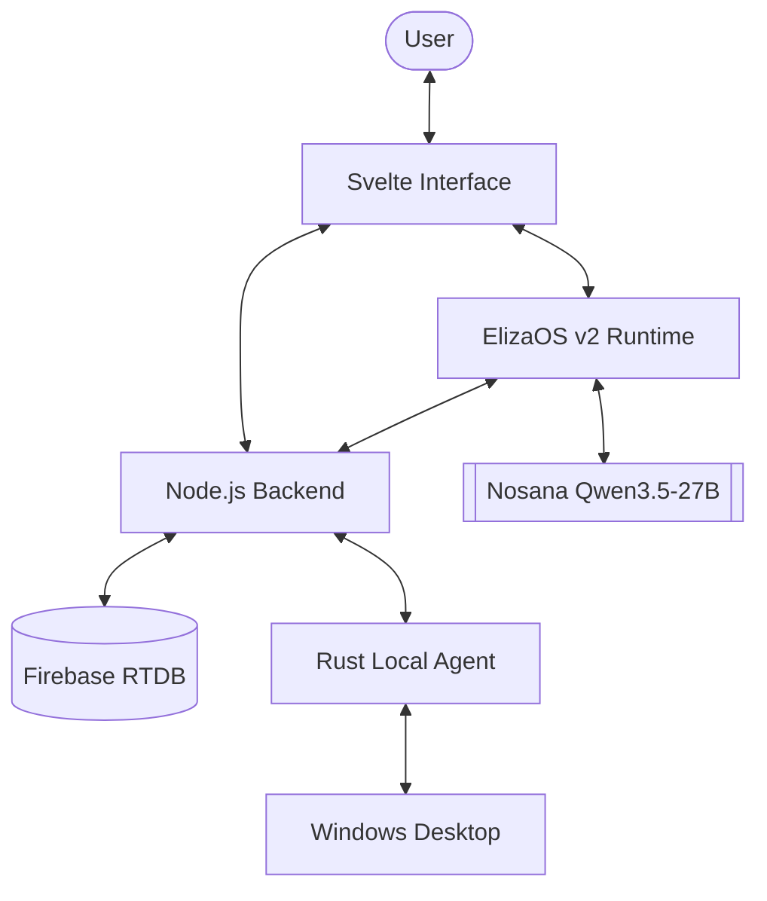
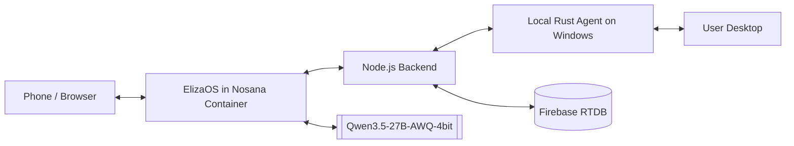

# Noogler

Noogler is a closed-loop embodied AI agent that operates directly on your computer.

Instead of relying only on APIs, Noogler sees the screen, reasons about what it observes, and takes actions using the mouse and keyboard—just like a human would. It can open software, navigate interfaces, fix errors, and continue working until a task is complete.

If a task could be done by hiring someone to operate a PC, Noogler can do it too.

From vibe coding and software development to creating 3D models in tools like Blender, working inside game engines such as Unity or Unreal Engine, generating art, running programs, or performing complex workflows across multiple applications—Noogler autonomously plans, executes, observes results, and adapts until the goal is achieved.

---

# Overview

**Noogler** is an AI powered coworker that lives inside your computer. It acts as your **eyes, ears, and hands**, observing your desktop through screen capture and interacting with it as a human would.

Instead of just interacting with APIs, **Noogler** operates desktop applications directly through their coordinate-based interfaces, making it capable of handling workflows in browsers, IDEs, Slack, Excel, or any other software.

### The Brain
Powered by **ElizaOS v2** running on **Nosana (Qwen3.5-27B-AWQ-4bit)**, it reasons over desktop state and sends executable steps to the local automation agent.

---

# Core Capabilities

### 👁️ Real-time Perception
The Intern continuously observes your screen, allowing it to interpret UI layouts, detect application states, and identify visual elements like buttons and text.

### ✋ UI Interaction
It interacts with Windows using:
*   **Mouse Automation**: Clicks, drags, and movement.
*   **Keyboard Input**: Typing, shortcuts, and navigation.
*   **Process Control**: Opening and managing applications.

### 🗣️ Multimodal Dialogue
*   **Text Chat**: Send high-level instructions over a standard chat interface.
*   **Voice Call**: Talk to your intern in real-time. It hears you and replies with a calm, reporting voice.
*   **Shared Context**: Both Chat and Voice share the exact same memory. If you tell it something over text, it will remember it during the voice call.

---

# Architecture

The system consists of three primary components that work in sync:

1.  **Cloud Backend (Node.js)**: The central logic hub. It manages user sessions, brokers messages between the UI and ElizaOS, and persists conversation history to Firebase.
2.  **Svelte Frontend**: A modern, purple-themed web interface for chat, voice call management, and agent configuration.
3.  **Local Agent (Rust)**: A lightweight, native Windows executable that performs the actual desktop automation and screen capture.

### Data Flow

```mermaid
flowchart TD
    User([User]) <--> Frontend[Svelte Interface]
    Frontend <--> Backend[Node.js Backend]
    Backend <--> Firebase[(Firebase RTDB)]
    Frontend <--> Eliza[ElizaOS v2 Runtime]
    Eliza <--> Nosana[[Nosana Qwen3.5-27B]]
    Eliza <--> Backend
    Backend <--> RustAgent[Rust Local Agent]
    RustAgent <--> Desktop[Windows Desktop]
```

---

# Repository Structure

```text
The-Intern/
├── backend/            # Node.js Server
│   ├── src/
│   │   ├── agent.ts    # Eliza orchestration & session management
│   │   ├── db.ts       # Firebase Realtime Database integration
│   │   └── server.ts   # WebSocket & REST server
│   └── .env            # API Keys & Config
├── frontend/           # Svelte + Vite App
│   ├── src/            # Chat & Call UI components
│   ├── public/         # Static assets (including intern-local.exe)
│   └── index.html      # Landing & Download page
├── client-rust/        # Native Windows Client
│   └── src/            # Screen capture & Input simulation
└── README.md
```

### Shared Memory (Firebase)
Memory is handled via **Firebase Realtime Database**. The `backend` buffers voice transcripts and text messages, committing them to a synchronized user trajectory. This ensures that every interaction—whether spoken or typed—is part of a single, cohesive memory.

---

# Installation & Setup

### 1. Prerequisites
*   **Node.js 23+**
*   **Rust (for building the client)**
*   **Firebase Project** (with Realtime Database enabled)
*   **Nosana endpoint access** (free endpoint supported)

### 2. Backend Setup
```bash
cd backend
npm install
# Configure your .env with ELIZA_BASE_URL and FIREBASE secrets
npm run dev
```

### 3. Frontend Setup
```bash
cd frontend
npm install
npm run dev
```

### 4. Local Agent (Windows)
```bash
cd client-rust
cargo build --release
```
Copy the resulting `intern-local.exe` from `target/release/` to `frontend/public/` to make it available for download.

#### Reduce Defender false positives (zero-cost)
- Build with a consistent release process: run `client-rust/scripts/release-windows.ps1` in PowerShell.
- The client now stores tray icon data in `%LOCALAPPDATA%\InternLocal` instead of `%TEMP%`.
- If Defender flags a build, submit the exact `.exe` to Microsoft:
  `https://www.microsoft.com/wdsi/filesubmission`
- For local development only, add a Defender exclusion on your local build directory.

---

# Tech Stack

*   **Logic**: Node.js (TypeScript)
*   **AI**: ElizaOS v2 + Nosana-hosted Qwen3.5-27B-AWQ-4bit
*   **Frontend**: SvelteKit, Vite, Vanilla CSS
*   **Automation**: Rust (enigo for input, scrap for capture)
*   **Database**: Firebase Realtime Database
*   **Deployment**: Vercel (Frontend), Node-ready hosting (Backend)

---

# License
MIT License


---

# ElizaOS v2 Integration

## New Runtime Folder
`eliza-agent/` contains the Eliza-compatible reasoning service used by `backend/src/agent.ts`.

- `eliza-agent/src/server.ts`: HTTP reasoning endpoints (`/reason/plan`, `/reason/action`, `/reason/chat`)
- `eliza-agent/src/plugins/desktop.ts`: custom `EXECUTE_ON_DESKTOP` action contract
- `eliza-agent/characters/noogler.json`: default Noogler character
- `eliza-agent/characters/homework-agent.json`, `office-assistant.json`: alternate personalities sharing the same desktop action plugin

## Eliza Setup (Bun)
```bash
# one-time
bun i -g @elizaos/cli

# run local reasoning service
cd eliza-agent
bun install
bun run start
```

## Updated Architecture

```mermaid
flowchart LR
    User[Phone / Browser] <--> Eliza[ElizaOS in Nosana Container]
    Eliza <--> Backend[Node.js Backend]
    Backend <--> Rust[Local Rust Agent on Windows]
    Rust <--> Desktop[User Desktop]
    Backend <--> Firebase[(Firebase RTDB)]
    Eliza <--> Nosana[[Qwen3.5-27B-AWQ-4bit]]
```

## Nosana Deployment (Backend + Eliza Agent)
1. Build and publish the root `Dockerfile`.
2. Deploy the image to `deploy.nosana.com`.
3. Expose backend port `8080` (and optionally Eliza internal `7070` if needed for debugging).
4. Set environment variables from `.env.example` in the Nosana deployment form.
5. Keep the Rust executable running on the user's local Windows machine; it connects over WebSocket to the backend.

## Environment Variables
See `.env.example` for full values, including:
- Backend: `PORT`, `LOG_LEVEL`, `ELIZA_BASE_URL`, Firebase credentials
- Eliza/Nosana: `ELIZA_PORT`, `NOSANA_BASE_URL`, `NOSANA_MODEL`, optional `NOSANA_API_KEY`, `ELIZA_CHARACTER`
